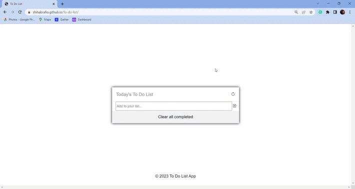

<a name="readme-top"></a>

<div align="center">
 <b> <i> <u> PREVIEW </u> </i></b> </br> </br>
 
</div>

<div align="center">
  <h3><b>A To do List</b></h3>
</div>

# :green_book: Table of Contents

- [:book: About the Project](#about-project)
  - [🛠 Built With](#built-with)
    - [Tech Stack](#tech-stack)
    - [Key Features](#key-features)
  - [:rocket: Live Demo](#live-demo)
- [:computer: Getting Started](#getting-started)
  - [Prerequisites](#prerequisites)
  - [Setup](#setup)
  - [Install](#install)
  - [Usage](#usage)
  - [Run tests](#run-tests)
  - [Deployment](#deployment)
- [:bust_in_silhouette: Author](#author)
- [:telescope: Future Features](#future-features)
- [:handshake: Contributing](#contributing)
- [:star:️ Show your support](#support)
- [:pray: Acknowledgements](#acknowledgements)
- [:memo: License](#license)

# :book: A To do List <a name="about-project"></a>

**A To do List**  is a website that allows users to create and manage their to-do lists online. These websites usually offer features such as the ability to create multiple lists, set due dates and reminders for tasks, prioritize tasks, and mark tasks as completed.

## 🛠 Built With <a name="built-with"></a>

### Tech Stack <a name="tech-stack"></a>

<details>
  <summary>Client</summary>
  <ul>
    <li><a href="https://webpack.js.org/">WEBPACK</a></li>
  </ul>
</details>

### Key Features <a name="key-features"></a>

- **Webpack**
- **Dynamics of HTML**

<p align="right">(<a href="#readme-top">back to top</a>)</p>

<!-- LIVE DEMO -->

## 🚀 Live Demo <a name="live-demo"></a>

- [Live Demo Link]( https://shihabrafio.github.io/To-do-list/)

<p align="right">(<a href="#readme-top">back to top</a>)</p>

## :computer: Getting Started <a name="getting-started"></a>

To get a local copy up and running, follow these steps.

### Prerequisites

In order to run this project you need:

- A web browser to view output e.g [Google Chrome](https://www.google.com/chrome/).
- An IDE e.g [Visual studio code](https://code.visualstudio.com/).
- [A terminal](https://code.visualstudio.com/docs/terminal/basics).

### Setup

Clone this repository to your desired folder or download the Zip folder:

```sh
    "git clone https://github.com/shihabrafio/To-do-list.git"
```

- Navigate to the location of the folder in your machine:

```sh
    cd ./user/
```

### Install

Install all dependencies:

```sh
    "npm install"
```

### Usage

To run the project, follow these instructions:

- After Cloning this repo to your local machine.
- To get it running on your default browser and local host, run:

```sh
     " Open the index.html in the project directory with your preferred browser to run the project"
```

### Run tests

To run tests, run the following command:

- HTML linter errors run:

```
npx hint .
```

- CSS linter errors run:

```
npx stylelint "**/*.{css,scss}"
```

- JavaScript linter errors run:

```
npx eslint .
```

- For unit testing, run:

```
npm test
```

### Deployment <a name="deployment"></a>

You can deploy this project using: GitHub Pages,

- I used GitHub Pages to deploy my website.
- For more information about publishing sources, see "[About GitHub pages](https://docs.github.com/en/pages/getting-started-with-github-pages/about-github-pages#publishing-sources-for-github-pages-sites)".

<p align="right">(<a href="#readme-top">back to top</a>)</p>

## :bust_in_silhouette: Author <a name="author"></a>


👤 *A.I.M. Shihab Uddin Khan*
- GitHub: [@shihabrafio](https://github.com/shihabrafio)
- Twitter: [@shihab_uddin19](https://twitter.com/shihab_uddin19)
- LinkedIn: [Shihab Uddin Khan](https://www.linkedin.com/in/shihab-uddin-khan-45620a16a/)

<p align="right">(<a href="#readme-top">back to top</a>)</p>

## :telescope: Future Features <a name="future-features"></a>

- **Headers and footers**
- **Setup Navigations > Book lists, Add books & Contact information**
- **Implement unit testing**

<p align="right">(<a href="#readme-top">back to top</a>)</p>

## :handshake: Contributing <a name="contributing"></a>

Contributions, issues, and feature requests are welcome!

Feel free to check the [issues page](../../issues/).

<p align="right">(<a href="#readme-top">back to top</a>)</p>

## :star:️ Show your support <a name="support"></a>

Give a :star:️ if you like this project and how I managed to build it!

<p align="right">(<a href="#readme-top">back to top</a>)</p>

## :pray: Acknowledgments <a name="acknowledgements"></a>

- Creative Commons license of the design
- I would like to thanks all my coding partners at Microverse

<p align="right">(<a href="#readme-top">back to top</a>)</p>

## :memo: License <a name="license"></a>

This project is [MIT](LICENSE) licensed.

<p align="right">(<a href="#readme-top">back to top</a>)</p>
